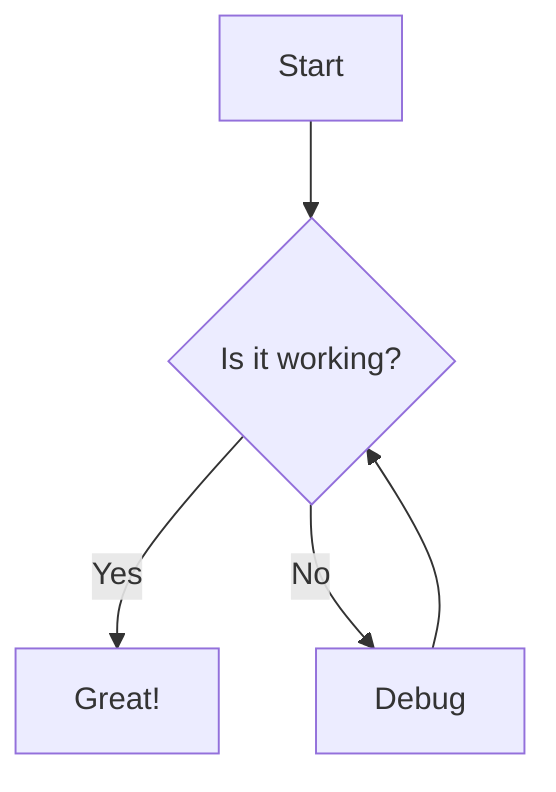

# 📝 Markdown Viewer

<div align="center">


**A modern, feature-rich Markdown editor and viewer with Mermaid diagram and MathJax support.**

[](https://github.com/akshitsutharr/md-viewer)
[](https://github.com/akshitsutharr/md-viewer)
[](https://github.com/akshitsutharr/md-viewer)
[](LICENSE)

[Live Demo](#live-demo) • [Features](#features) • [Getting Started](#getting-started) • [Documentation](#documentation)

</div>

---

## Table of Contents

- [Overview](#overview)
- [Live Demo](#live-demo)
- [Features](#features)
- [Tech Stack](#tech-stack)
- [Getting Started](#getting-started)
- [Usage Guide](#usage-guide)
- [Advanced Features](#advanced-features)
- [Keyboard Shortcuts](#keyboard-shortcuts)
- [Customization](#customization)
- [Browser Support](#browser-support)
- [Documentation](#documentation)
- [Security](#security)
- [Performance](#performance)
- [Contributing](#contributing)
- [License](#license)
- [Acknowledgments](#acknowledgments)

---

## Overview

**Markdown Viewer** is a modern web-based Markdown editor and previewer designed to provide a smooth split-pane editing experience with live preview, syntax highlighting, Mermaid diagrams, MathJax equations, and emoji rendering. The app runs entirely in the browser and ships as a static site with CDN-hosted dependencies.

### Why Use This Viewer?

- ✅ Zero install for users: open `index.html` or serve a static folder
- ✅ Real-time preview with debounce
- ✅ Mermaid diagrams and MathJax equations
- ✅ Light/dark themes with system preference detection
- ✅ Export to Markdown, HTML, and PDF
- ✅ Responsive layout with mobile-friendly controls

---

## Live Demo

Add your hosted URL here. If you do not have one yet, use a static host like GitHub Pages or Netlify.

---

## Features

### Core Functionality

#### Live Markdown Editing
- Real-time rendering with a debounced render loop
- GitHub-flavored Markdown via Marked.js
- Syntax highlighting via Highlight.js
- Emoji shortcodes rendered via JoyPixels

#### Dual Theme System
- Light and dark modes
- Automatic system theme detection on load
- Theme-aware Mermaid rendering

#### Split-Pane Interface
- Editor-only, split, and preview-only modes
- Resizable panes with a minimum width guard
- Optional synchronized scrolling in split mode

#### Mermaid Diagrams
Render diagrams in fenced blocks:



#### Mathematical Equations
Support for MathJax LaTeX syntax:

Inline: `$E = mc^2$`

Block:

```
$$
\int_{-\infty}^{\infty} e^{-x^2} dx = \sqrt{\pi}
$$
```

### Import and Export

#### Import
- Drag and drop `.md` or `.markdown` files
- File picker import with the same extension filters

#### Export
- Markdown (`.md`)
- HTML (`.html`) with GitHub Markdown CSS and Highlight.js theme
- PDF (`.pdf`) via html2pdf.js

#### Clipboard
- One-click copy of raw Markdown

### Editor Utilities

- Word count, character count, and reading time
- Tab key inserts two spaces for indentation

---

## Tech Stack

### Core Technologies
| Technology | Version | Purpose |
|-----------|---------|---------|
| HTML5 | - | Semantic structure |
| CSS3 | - | Responsive layout and theming |
| JavaScript (ES6+) | - | Application logic |
| Bootstrap | 5.3.2 | Layout and UI utilities |

### Libraries and Dependencies

#### Markdown and Sanitization
- [Marked.js](https://marked.js.org/) (v9.1.6)
- [DOMPurify](https://github.com/cure53/DOMPurify) (v3.0.9)

#### Syntax Highlighting
- [Highlight.js](https://highlightjs.org/) (v11.9.0)
- [GitHub Markdown CSS](https://github.com/sindresorhus/github-markdown-css) (v5.3.0)

#### Diagrams and Math
- [Mermaid](https://mermaid.js.org/) (v11.6.0)
- [MathJax](https://www.mathjax.org/) (v3.2.2)

#### Export and Files
- [html2pdf.js](https://github.com/eKoopmans/html2pdf.js) (v0.10.1)
- [jsPDF](https://github.com/parallax/jsPDF) (v2.5.1)
- [html2canvas](https://html2canvas.hertzen.com/) (v1.4.1)
- [FileSaver.js](https://github.com/eligrey/FileSaver.js) (v2.0.5)
- [pdfMake](http://pdfmake.org/) (v0.2.7)

#### UI Enhancements
- [Bootstrap Icons](https://icons.getbootstrap.com/) (v1.11.3)
- [JoyPixels Emoji Toolkit](https://github.com/joypixels/emoji-toolkit) (v9.0.1)

### Fonts
- Space Grotesk (UI)
- IBM Plex Mono (code)

---

## Getting Started

### Prerequisites

None. This is a static site that runs in any modern browser.

### Run Locally

```bash
# Clone the repository
git clone https://github.com/akshitsutharr/md-viewer.git

# Navigate into the directory
cd md-viewer

# Start a local server (Python 3)
python -m http.server 8000
```

Open http://localhost:8000 in your browser.

### Direct File Access

You can also open `index.html` directly without a server.

---

## Usage Guide

1. Type or paste Markdown into the editor.
2. The preview updates automatically.
3. Switch view modes with the header buttons.
4. Toggle sync scrolling when in split view.
5. Import or export files using the toolbar.

---

## Advanced Features

### Mermaid Diagrams
Use fenced Mermaid blocks to render diagrams. The renderer initializes after each preview update to keep diagrams in sync with content.

### MathJax Equations
MathJax runs after render to typeset formulas in both inline and block form.

### HTML Export
HTML export wraps the sanitized output in a standalone page using GitHub Markdown CSS and a matching Highlight.js theme.

---

## Keyboard Shortcuts

- `Ctrl` / `Cmd` + `S` - Export Markdown
- `Ctrl` / `Cmd` + `C` - Copy Markdown
- `Ctrl` / `Cmd` + `Shift` + `S` - Toggle sync scrolling (split view only)
- `Tab` - Insert two spaces inside the editor

---

## Customization

- Update theme colors in [styles.css](styles.css) under the CSS variables section.
- Change render timing or limits in [script.js](script.js) (`RENDER_DELAY`, `MIN_PANE_PERCENT`).
- Adjust export settings in [script.js](script.js) (HTML template, PDF config).
- Modify sample content in [script.js](script.js) (`sampleMarkdown`).

---

## Browser Support

Supports the latest versions of Chrome, Edge, Firefox, and Safari on desktop and mobile. Older browsers may not fully support modern CSS features like `color-mix` or `backdrop-filter`.

---

## Documentation

### Rendering Pipeline
1. Markdown is parsed with Marked.js.
2. Output is sanitized with DOMPurify.
3. Code blocks are highlighted with Highlight.js.
4. Mermaid diagrams are initialized and rendered.
5. MathJax typesets equations.

### Export Pipeline
- Markdown export saves the raw editor content.
- HTML export builds a standalone HTML file with styles.
- PDF export converts the preview content with html2pdf.js.

---

## Security

Markdown rendering can be a source of XSS if raw HTML is allowed. This project sanitizes output with DOMPurify, but you should still treat external Markdown as untrusted.

If you want stricter Mermaid rendering, set `securityLevel` to `strict` in the Mermaid initialization inside [script.js](script.js).

---

## Performance

- Rendering is debounced to reduce UI jitter.
- For large documents, consider increasing `RENDER_DELAY` or disabling sync scrolling.
- PDF export may take longer for large or media-heavy documents.

---

## Contributing

1. Fork the repository
2. Create a feature branch
3. Make focused, well-scoped changes
4. Open a pull request with a clear description

---

## License

This project references the MIT license. See [LICENSE](LICENSE) for details.

---

## Acknowledgments

Thanks to the open-source libraries that make this project possible:

- Marked.js
- Highlight.js
- DOMPurify
- Mermaid
- MathJax
- html2pdf.js
- Bootstrap and Bootstrap Icons
